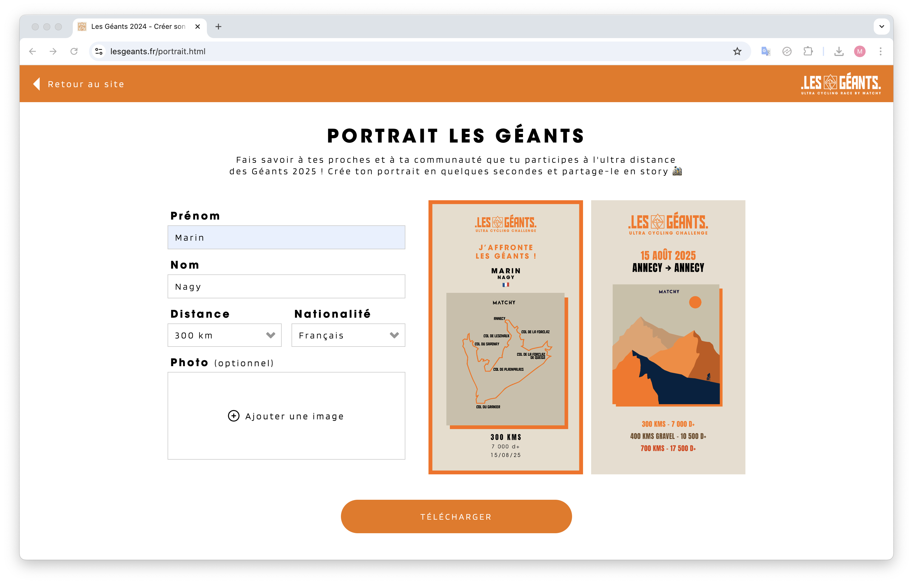

# ⚽ Générateur de portrait de course - Les Géants 2025

### 🔗 Live : [lesgeants.fr/portrait.html](https://lesgeants.fr/portrait.html)

Une page web qui permet aux participants de l'événement d'ultra cyclist de créer leurs portrait de course. Incluant leur informations personnel, le parcours séléctionné ainsi qu'une photo. Le portrait se compose de deux images au format 16:9 qui peut etre partagé en story sur les réseaux sociaux.

## 🛠️ Stack technique

- Front-end en **HTML/CSS**
- Logic et génération en **JS** avec l'utilisation de canvas
- Hébergement : **OVH**

## 📊 Fonctionnalités actuelles

- Personalisation du nom, prénom, nationalité et parcours
- Deux vesions de portrait, avec et sans photo
- Téléchargement des portraits au format JPEG
- Interface responsive, pensée en mobile first
